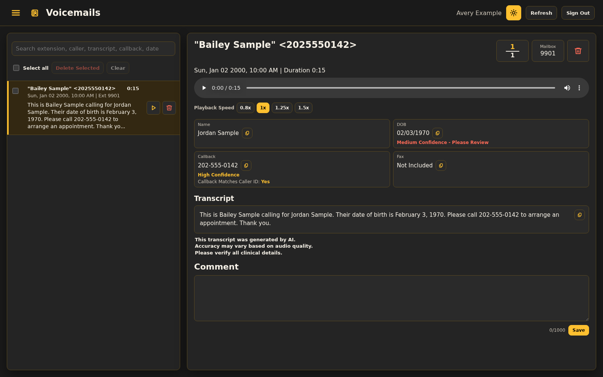
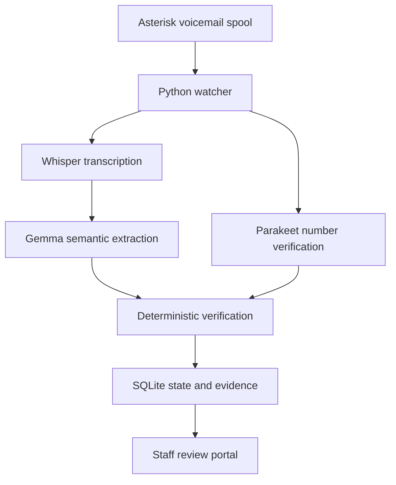

# Local Voicemail AI

A self-hosted AI voicemail transcription and structured-review system built for a
five-site healthcare environment. Python coordinates Whisper Large-v3 through
faster-whisper, Parakeet TDT, a locally hosted Gemma model through LiteRT, and
deterministic validation before presenting messages to staff for review.



The interface above was recreated with fictional data. Its confidence labels are
illustrative, not measured model results. [Walkthrough](demo/synthetic-message.md)
and [image provenance](docs/images/README.md).

## Deployment context

The developer reports deployment across five healthcare sites and approximately
**150 messages per day**. Local processing was intended to keep sensitive audio
and derived data inside the organization's environment. These are deployment
context figures, not independent accuracy, performance, or clinical measurements.

This repository is a **portfolio/reference implementation** of the application.
It is not a certified clinical product or a turnkey production deployment.
It includes synthetic fixtures and configuration examples; production data and
site configuration are not included.

## Processing flow



The watcher discovers voicemail files, queues processing, and records status.
Whisper supplies the primary transcript. Gemma extracts structured candidates;
Parakeet supplies additional audio evidence for important numbers. Python checks
names, dates of birth, callback numbers, and fax numbers before the portal shows
the result alongside the audio and review state.

## Engineering decisions

- **Models propose; code checks.** A plausible model response is not sufficient
  evidence. Deterministic verification validates schemas, normalizes fields,
  compares sources, and preserves ambiguity when the evidence conflicts.
- **Keep evidence separate from presentation.** Raw candidates and verification
  records remain available while provisional corrections are applied to the
  staff-facing transcript. This makes disagreements diagnosable.
- **Treat voicemail as a workflow.** Stable message identity, SQLite state,
  retries, duplicate handling, and bounded provider requests support ingestion
  beyond a single model call.
- **Make review explicit.** Confidence and review flags help staff decide what to
  check. Audio remains accessible; uncertain results are not unconditional
  approvals. People remain responsible for important information.
- **Separate service contracts.** Transcription, extraction, and number
  verification communicate through bounded HTTP interfaces. The source supports
  local services and separation of PBX-facing processing from AI inference.

## Privacy and security design

The architecture uses local inference and mailbox-authorized access. The portal
includes password hashing, signed sessions, CSRF checks, and mailbox filtering.
An optional read-only API adds scoped bearer tokens and request limits.
Email, forwarding, and raw model-response logging are off by default.

Local hosting alone does not provide encryption, access governance, or regulatory
compliance. Production use requires an independent security and operational
review. This project makes no HIPAA compliance or certification claim.
See [security design](docs/SECURITY_AND_PHI.md) and [reporting policy](SECURITY.md).

## Source map

| Engineering area | Start here |
| --- | --- |
| Ingestion, processing state, retry handling | [watcher.py](watcher.py), [voicemail_watcher](voicemail_watcher/) |
| Primary transcription and ASR evidence | [whisper_server.py](whisper_server.py), [asr_lattice.py](asr_lattice.py) |
| Additional number verification | [parakeet_server.py](parakeet_server.py) |
| Gemma requests and candidate orchestration | [litert_chat_web.py](litert_chat_web.py), [extraction_orchestrator.py](extraction_orchestrator.py), [prompts](prompts/) |
| Deterministic extraction and resolution | [candidate_extractor.py](candidate_extractor.py), [final_resolver.py](final_resolver.py), [verification.py](verification.py) |
| Portal backend, embedded UI, and authorization | [voicemail_portal.py](voicemail_portal.py), [voicemail_portal_app](voicemail_portal_app/) |
| Shared database and spool helpers | [voicemail_common](voicemail_common/) |
| Behavioral regression and API tests | [tests](tests/), especially [test_core.py](tests/test_core.py) and [test_api_v1.py](tests/test_api_v1.py) |
| Configuration and boundaries | [configuration](docs/CONFIGURATION.md), [architecture](docs/ARCHITECTURE.md) |

The package modules provide focused interfaces around the existing application;
the larger root modules contain its principal implementations.

## Technology

Python 3.11+, FastAPI, SQLite, watchdog, Whisper Large-v3/faster-whisper,
Parakeet TDT, Gemma/LiteRT, and an HTML/CSS/JavaScript review interface.
Tests use pytest, unittest, synthetic files, mocked model responses, and
in-process HTTP clients.

## Development and tests

In a disposable Linux development workspace with Python 3.11.8 or newer:

```bash
python3.11 -m venv .venv
. .venv/bin/activate
python -m pip install --upgrade pip
python -m pip install -e '.[dev]'
python -m pytest -q
```

The development dependencies do not download model weights or install the large
AI runtime stack. Tests exercise real extraction, resolution, storage, provider,
and API code with synthetic inputs and mocked inference. Their pass count is not
a measure of transcription accuracy.

The [validation guide](docs/VALIDATION.md) lists all CI gates, including privacy,
secrets, links, lint, packaging, and a clean-wheel installation check. Installing
the source does not configure a PBX or start any service.

## Known limitations

- Real model inference, throughput, and end-to-end accuracy are not measured by
  the fixture suite. Separately provisioned compatible runtimes and local model
  weights are required to run inference.
- Names, unclear audio, and ambiguous numbers can produce errors. Human review
  is part of the design, not a fallback guarantee.
- System installers, service provisioning, release assets, and upgrade/rollback
  automation are outside this reference repository's scope.
- Runtime defaults include conventional Asterisk paths. Use a disposable
  synthetic workspace and explicit configuration for development; the test
  suite supplies its own temporary paths and does not require a live PBX.

## License and independence

Source code is licensed under [Apache-2.0](LICENSE). Third-party models and
dependencies retain their own terms; see [model licenses](docs/MODEL_LICENSES.md)
and [NOTICE](NOTICE). No weights or vendor binaries are bundled.

This is an independent project. Product names identify integrations and do not
imply endorsement by Asterisk, VitalPBX, Google, NVIDIA, or another vendor.
